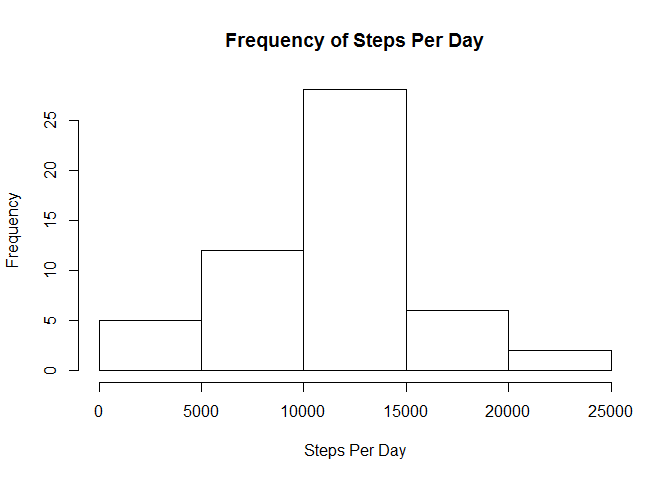
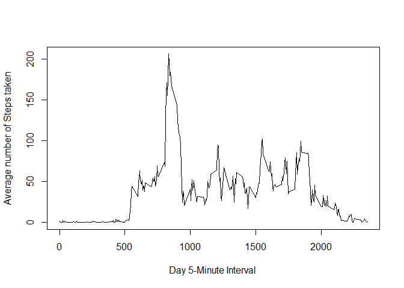
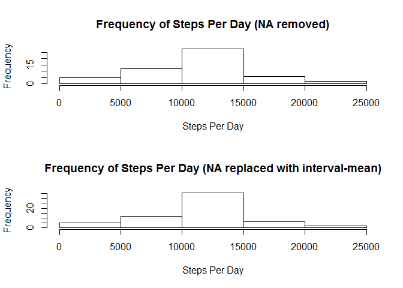
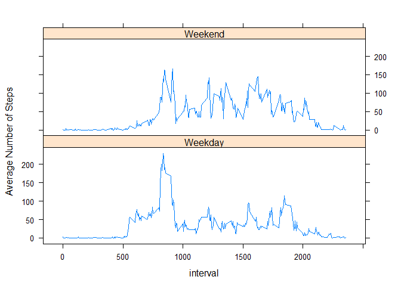

# Reproducible Research: Peer Assessment 1

## Loading and preprocessing the data.
#### Loading

```r
require("data.table")
library(data.table)
library(lattice)
library(stringr)
if("doBy" %in% rownames(installed.packages()) == FALSE) {install.packages("doBy")}
library(doBy)

url_src_zip  <- "https://d396qusza40orc.cloudfront.net/repdata%2Fdata%2Factivity.zip"
fil_src_zip  <- "repdata-Fdata-Factivity.zip"
dir_src_data <- getwd()
flp_src_zip <- paste(dir_src_data, fil_src_zip, sep = "/")

# Download the sourze zip file to the Source-Local directory if it's not there already.
if (!file.exists(flp_src_zip)) {
    download.file(url_src_zip, destfile = flp_src_zip)
}    

# If the .zip hasn't been unzipped to the .csv file, do so.
if (!file.exists("Source_Classification_Code.rds")) {
    unzip(flp_src_zip, overwrite=TRUE)
}    
```
#### Preprocessing

Read the .txt file into a data.table.  Change any strings with "NA" to the not-available type.

```r
dt_activity_raw <- fread("activity.csv", sep = ",", header = TRUE, na.strings = c("NA",""))
```

Convert the "date" column from datatype "chr" to "date".

```r
dt_activity_raw$date <- as.Date(dt_activity_raw$date)
```

Create a "clean" data set containing rows with non-NA values for "steps".

```r
dt_activity_no_na <- subset(dt_activity_raw, !is.na(steps))
```


## What is mean total number of steps taken per day?


Calculate the SUM/MEAN of the steps by date and save to new data.table.

```r
dt_activity_datesummary <- summaryBy(
    steps ~ date, 
    data = dt_activity_no_na, 
    keep.names = FALSE, 
    FUN = c(sum,mean,median))
```


Histogram of the total number of steps taken each day

```r
hist(dt_activity_datesummary$steps.sum
    ,xlab = "Steps Per Day"
    ,ylab = "Frequency"
    ,main = "Frequency of Steps Per Day"
    )
```

\


Calculate the mean and meadian number of steps taken each day

```r
CentralTendencies <- matrix(
    c(mean(dt_activity_no_na$steps), median(dt_activity_no_na$steps), nrow(dt_activity_no_na))
    ,ncol=3,byrow=TRUE
)
colnames(CentralTendencies) <- c("Mean Steps","Median Steps","Rowcount")
rownames(CentralTendencies) <- c("Non-NA Dataset")
CentralTendencies <- as.table(CentralTendencies)
CentralTendencies
```

```
##                Mean Steps Median Steps   Rowcount
## Non-NA Dataset    37.3826       0.0000 15264.0000
```


## What is the average daily activity pattern?


Calculate the SUM/MEAN of the steps by time and save to new data.table.

```r
dt_activity_timesummary <- summaryBy(
    steps ~ interval, 
    data = dt_activity_no_na, 
    keep.names = FALSE, 
    FUN = c(sum,mean))
```

Time series plot of the average number of steps taken

```r
plot(
    x = dt_activity_timesummary$interval
    , y = dt_activity_timesummary$steps.mean
    , type = "l"
    , xlab = "Day 5-Minute Interval "
    , ylab = "Average number of Steps taken"
)
```

\

Which 5-minute interval, on average across all the days in the dataset, contains the maximum number of steps?

```r
dt_activity_timesummary[which.max(steps.mean)]
```

```
##    interval steps.sum steps.mean
## 1:      835     10927   206.1698
```


## Inputing missing values


Calculate and report the total number of missing values in the dataset (i.e. the total number of rows with NAs).

```r
nrow(dt_activity_raw[is.na(steps)==1,])
```

```
## [1] 2304
```
### Devise a strategy for filling in all of the missing values in the dataset. 

The strategy does not need to be sophisticated. For example, you could use the mean/median for that day, or the mean for that 5-minute interval, etc.

Create a new "steps" column (steps_ascr) to which we will ascribe values where they are missing.

```r
dt_activity_raw$steps_ascr = as.numeric(dt_activity_raw$steps)
```


From the raw data, identify and record a vector of row pointers where there are missing values in "Steps" column.  
This can be used to tell us which rows need updating.

```r
missing_steps <- which(is.na(dt_activity_raw$steps)==1)
```


Now loop through each row pointer, looking up each row's "interval" value.  
Then go lookup the average for that interval already recorded in data table dt_activity_timesummary.
Then copy that average to the new "steps_ascr" column.

```r
for(i in 1:length(missing_steps)) {
    dt_activity_raw[missing_steps[i]]$steps_ascr <- dt_activity_timesummary[interval==dt_activity_raw[missing_steps[i],interval], steps.mean]
}
```

Create a new dataset that is equal in rowcount to the original dataset. 

```r
dt_activity_ascr <- dt_activity_raw[,.(steps_ascr, date, interval)]
colnames(dt_activity_ascr)[1] <- "steps"
```

Make a histogram of the total number of steps taken each day and 

```r
dt_activity_ascr_datesummary <- summaryBy(
    steps ~ date, 
    data = dt_activity_ascr, 
    keep.names = FALSE, 
    FUN = c(sum,mean,median))
```

Create a multi-plot of 2 histograms illustrating how the additional data supplied from the ascribed step values increased the frequency in the "10K-15K Steps Per Day" range.
The ascription m.

```r
par(mfrow = c(2, 1))    

hist(dt_activity_datesummary$steps.sum
     ,xlab = "Steps Per Day"
     ,ylab = "Frequency"
     ,main = "Frequency of Steps Per Day (NA removed)"
)
hist(dt_activity_ascr_datesummary$steps.sum
     ,xlab = "Steps Per Day"
     ,ylab = "Frequency"
     ,main = "Frequency of Steps Per Day (NA replaced with interval-mean)"
)
```

\

### Calculate and report the mean and median total number of steps taken per day.

```r
CentralTendencies <- matrix(
    c(
    mean(dt_activity_no_na$steps), median(dt_activity_no_na$steps), nrow(dt_activity_no_na),
    mean(dt_activity_ascr$steps),  median(dt_activity_ascr$steps), nrow(dt_activity_ascr)
    )
    ,ncol=3,byrow=TRUE
    )
colnames(CentralTendencies) <- c("Mean Steps","Median Steps","Rowcount")
rownames(CentralTendencies) <- c("Non-NA Dataset", "NA-Ascribed Dataset")
CentralTendencies <- as.table(CentralTendencies)
CentralTendencies
```

```
##                     Mean Steps Median Steps   Rowcount
## Non-NA Dataset         37.3826       0.0000 15264.0000
## NA-Ascribed Dataset    37.3826       0.0000 17568.0000
```


## Are there differences in activity patterns between weekdays and weekends?


Create and assign a dayofweek column.

```r
dt_activity_ascr$dayofweek  <- weekdays(dt_activity_ascr$date)
```

Create a new factor variable in the dataset with two levels - "weekday" and "weekend" indicating whether a given date is a weekday or weekend day.

```r
dt_activity_ascr$daytype <- ifelse(dt_activity_ascr$dayofweek=="Saturday" | dt_activity_ascr$dayofweek=="Sunday","Weekend", "Weekday")
```

Aggregate the Steps by Interval and DayType

```r
dt_activity_ascr_timesummary_intervalbydaytype <- summaryBy(
    steps ~ interval | daytype, 
    data = dt_activity_ascr, 
    keep.names = FALSE, 
    FUN = c(sum,mean))

xyplot(steps.mean ~ interval | daytype
    ,data = dt_activity_ascr_timesummary_intervalbydaytype
    ,type ="l"
    ,layout = c(1,2)
    ,ylab = "Average Number of Steps"
    )
```

\
